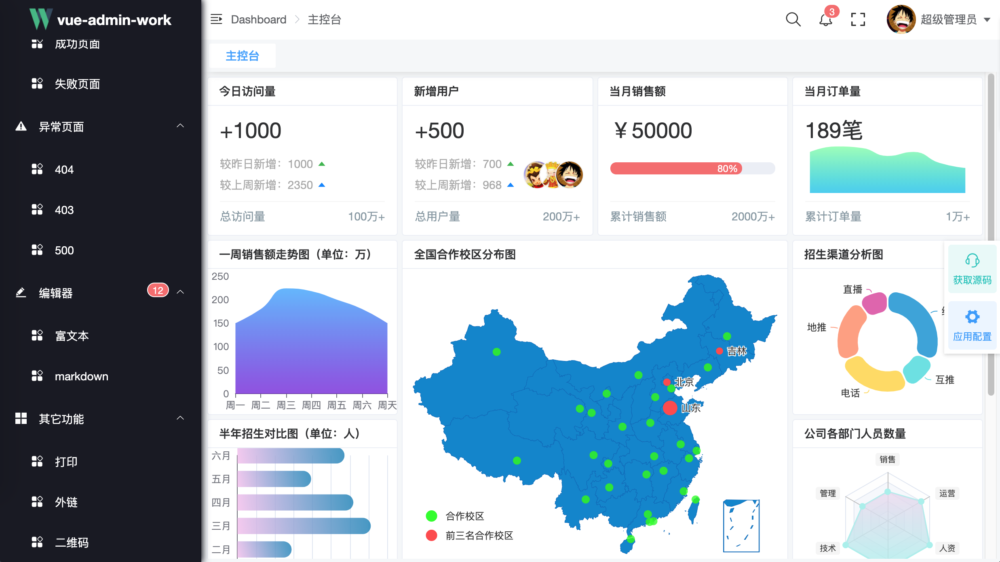
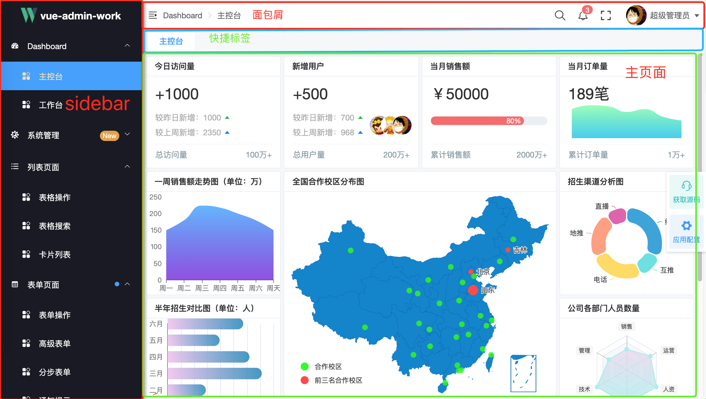
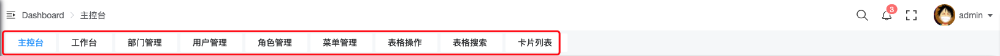
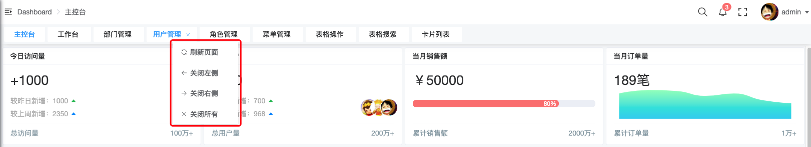
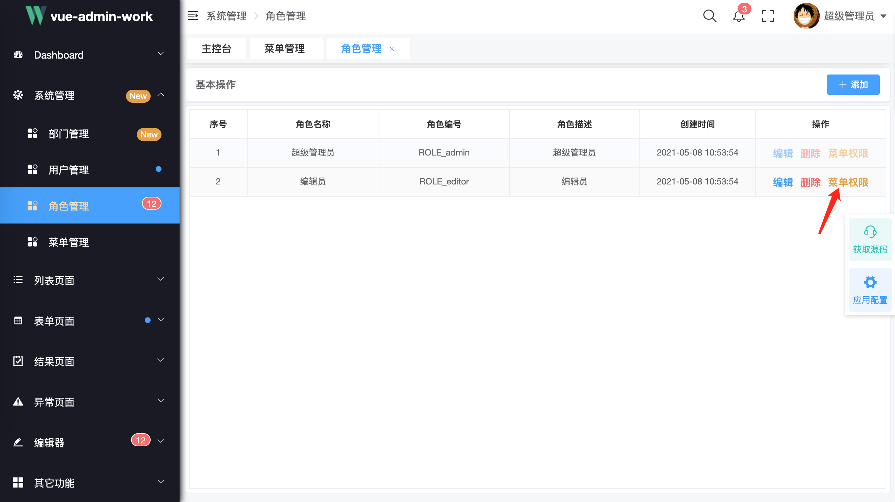
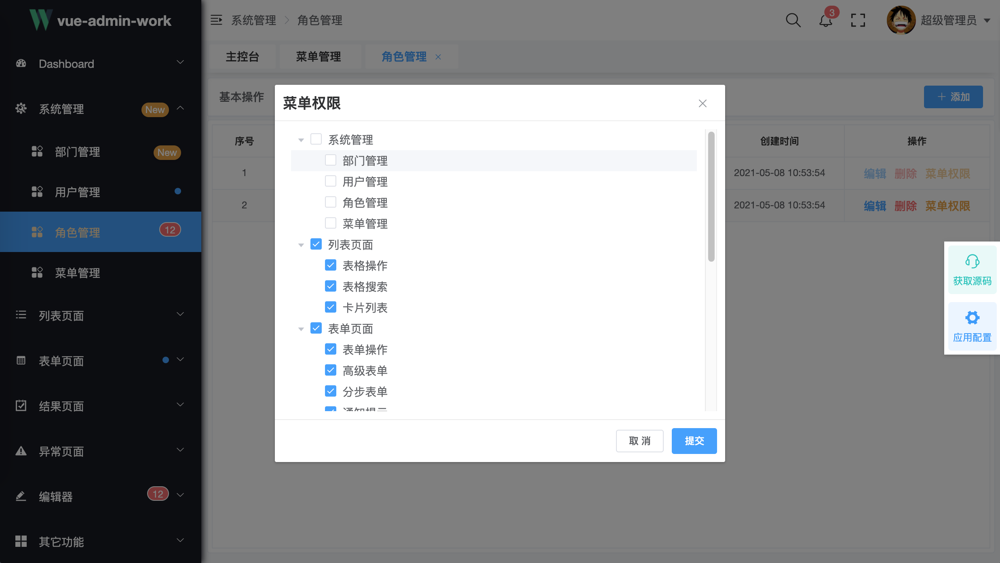
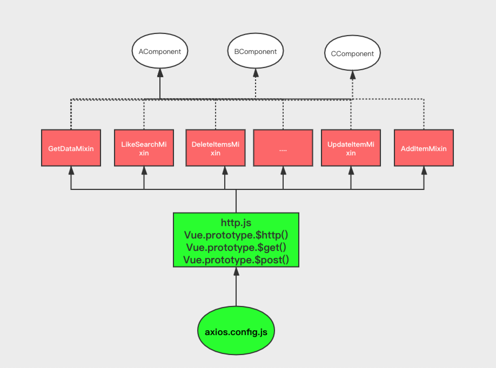

<div align="center"></div>
<h1 align="center">vue-admin-work说明文档</h1>
<h6 align="right">版本：v0.1.0-rc</h6>


###  介绍

**[vue-admin-work](http://qingqingxuan.gitee.io/vue-admin-work/)**是一款后台前端框架，是基于 [vue](https://github.com/vuejs/vue) 和 [element-ui](https://github.com/ElemeFE/element)实现。它使用了最新的前端技术栈，内置了动态路由，权限验证，把后台常用的一些操作进行了封装，只需要简单的配置就可以实现常用的功能，同时也提供了丰富的功能组件，最大程度上满足你在后台前端开发中遇到的业务场景。同时这也是一款适合有一定基础的同学想要提高自己的前端水平的学习框架。如果你之前是从事一些简单的切图只写一些静态页面（html+css），这也是一款非常适合你进入编程化前端的框架，实现高薪的梦想。无论是你想用来做什么这款框架都能帮到你。

#### 功能

```json
- 登录、注销
- Dashboard
	- 主页
	- 工作台
- 系统管理
  - 部门管理
  - 用户管理
	- 角色管理
	- 菜单管理
- 列表页面
	- 表格操作
	- 表格搜索
	- 卡片列表
- 表单页面
	- 表单操作
	- 高级表单
	- 分步表单
	- 通知提示
- 结果页面
	- 成功页面
	- 失败页面
- 异常页面
	- 404
	- 403
	- 500
- 编辑器
	- 富文本
	- markdown
- 其它功能
	- 打印
	- 外链
	- 二维码
	- 未完待续……

- 全局功能
  - 多种动态换肤
  - 动态侧边栏（支持多级路由嵌套）
  - 动态面包屑
  - 快捷导航(标签页)
  - Svg Sprite 图标
  - 本地/后端 mock 数据
  - Screenfull全屏
	- 消息提醒
  - 自适应收缩侧边栏
	- 系统配置
```

#### 项目目录

```shell
├── README.md
├── babel.config.js
├── jest.config.js
├── jsconfig.json
├── mock
│   ├── base.js
│   ├── index.js
│   ├── list
│   ├── router
│   └── user
├── package-lock.json
├── package.json
├── public
│   ├── favicon.ico
│   ├── index.html
│   └── static
├── src
│   ├── App.vue
│   ├── main.js
│   ├── api
│   ├── assets
│   ├── components
│   ├── directive
│   ├── icons
│   ├── layout
│   ├── mixins
│   ├── model
│   ├── router
│   ├── store
│   ├── styles
│   ├── utils
│   └── views
└── vue.config.js

#### 获取源码

> **重要提示**：
>
> **无论通过哪种方式都得需要你提前在自己的电脑上安装好[node](http://nodejs.cn/)环境，如不清楚安装过程，请上网查阅相关资料。这里假定你已经在电脑上安装好[node](http://nodejs.cn/)环境**

+ 通过git，需要你提前在自己的电脑上安装好git环境。如不清楚安装过程，请上网查阅相关资料。

  **这里假定你已经在电脑上安装好git环境**

  ```shell
  // 通过git克隆代码
  git clone *****
  // 进入项目目录
  cd vue-admin-work
  // 安装依赖
  npm install
  // 运行项目
  npm run serve
```

+ 通过压缩文件，直接把文件解压出来，然后

  ```shell
  // 进入项目目录
  cd vue-admin-work
  // 安装依赖
  npm install
  // 运行项目
  npm run serve
  ```

启动完成后会自动打开浏览器访问 [http://localhost:5566](http://localhost:9527/)， 代表运行成功。



#### 开发工具

本项目开发工具是：[**vscode**](https://code.visualstudio.com/) 。也是作者推荐的开发工具，结合一些丰富的插件让你在开发过程中体验更加美好

>推荐几款常用的开发**vue**的插件
>
>+ [vetur](https://github.com/vuejs/vetur) 开发vue项目必备插件
>+ **Auto Close Tag**  自动闭合HTML/XML标签
>+ **Auto Rename Tag**  自动完成另一侧标签的同步修改
>+ **Path Intellisense**  自动路径补全
>+ **HTML CSS Support**  让 html 标签上写class 智能提示当前项目所支持的样式

以上插件是作者常用的几款，并不代表必须只需要这些，在实际开发中根据个人情况来定。

#### 反馈

如果你在使用过程中有任何的问题或者有好的建议都可以给作者反应，作者会根据实际需求进行增加或者改进。

联系方式如下：

> **QQ客服：353087890**
>
> **QQ群：89165685**
>
> **微信公众号：知码前端**

|  | 微信公众号 “知码前端” |  |
| :----------------------------------------------------------- | :----------------------------------------------------------: | ------------------------------------------------------------ |

### 布局-流程

#### Layout布局



页面的整体布局包括：侧边栏、导航栏、快捷标签、主页面四个部分组成。基中侧边栏最上面是一个企业logo容器，可以根据实际情况更新logo 和 标题。

对应的源码是：**src/layout/index.vue**。

> 注：此 layout 以后有可能会单独抽出成为一个独立的项目，以方便添加更多的布局样式。

#### SPA工作流程

SPA的是全称是：**Single Page Application** 中文意思是：单页面应用

结合[**Vue Router**](https://router.vuejs.org/)看一下匹配过程：

+ 首先是 **App.vue**

  ```vue
  <template>
    <div id="app">
      <router-view />
    </div>
  </template>
  
  <script>
  export default {
    name: 'App'
  }
  </script>
  ```

  App.vue中的 **<router-view />**匹配到的组件是**Layout**，这里的**Layout**就是 **src/layout/index.vue**

+ 其次是 **Layout**(src/layout/index.vue)，部分源码如下：

  ```vue
  <template>
    <div>
      <div>
        <SideBar />
      </div>
      <div>
        <div class="header-layout-wrapper">
          <NavBar/>
          <TagView/>
        </div>
        <section>
          // 重点看一下
          <AppMain />
        </section>
      </div>
      <Setting />
    </div>
  </template>
  ```

  在**Layout**组件中包含了一下**AppMain**组件

+ 最后是**AppMain**，部分源码如下：

  ```vue
  <template>
    <transition>
      <keep-alive>
        <router-view />
      </keep-alive>
    </transition>
  </template>
  ```

  可以看到**AppMain**中又包含了一个 <router-view/>组件，这样在**AppMain**又可以继续匹配路由了

+ 举例说明一下：

  在浏览器地址栏里输入以下链接是如何显示出页面的，这里忽略登录状态，假定用户已经登录，输入此链接会直接显出当前页面

  http://localhost:5566/#/index/main

  看一下部分路由表配置：

  ```js
  {
      path: '/index',
      name: 'index',
      component: Layout,
      hidden: false,
      meta: {
        title: 'Dashboard',
        icon: 'dashboard'
      },
      children: [
        {
          path: 'main',
          name: 'Main',
          component: () => import('@/views/index'),
          meta: {
            title: '主控台',
            affix: true,
            cacheable: true
          }
        }
      ]
    },
  ```

  当匹配到了 **'/index'** 路径是的时候，会加载对应的**Layout**组件，Layout组件中有一个AppMain组件，里面又包含了一个 <router-view />，同时可以看到路由表配置还有一个 **children**属性，完全匹配到**'/index/main'**路径的时候，path为'main'所对应的component组件被加载。

  大体就是这么一个匹配过程，具体的可以看 **[Vue Router](https://router.vuejs.org)**官网中[**嵌套路由文档**](https://router.vuejs.org/zh/guide/essentials/nested-routes.html)

### 路由

路由和侧边栏是一个后台管理项目的重点，也是一个比较难理解的地方

#### 知识准备

+ **Vue Router知识**
+ **element-ui 中的 ElMenu组件和ElScrollbar组件**
+ **router-link和router-view组件**

#### 说明 

本项目路由生成的思路如下：

1. 用户登录成功之后获取**token**和**role**
2. 通过后台接口查询该用户所对应角色的菜单列表
3. 前端处理获取到的菜单列表，按一定的规则动态生成路由表
4. 通过**vue-router**实例的**.addRoutes()**方法动态添加路由

#### 原始路由信息

以**editor**角色为例，从后台获取的原始路由信息如下：

```js
[
  {
    // 菜单地址
    menuUrl: '/list',
    // 菜单名称
    menuName: '列表页面',
    // 菜单图图标
    icon: 'list',
    // 所包含的子菜单
    children: [
      {
        menuUrl: '/list/table',
        menuName: '表格操作'
      },
      {
        menuUrl: '/list/table-with-search',
        menuName: '表格搜索'
      },
      {
        menuUrl: '/list/grid-list',
        menuName: '卡片列表'
      }
    ]
  },
  {
    menuUrl: '/form',
    menuName: '表单页面',
    // 菜单提示信息
    tip: 'circle',
    icon: 'form',
    children: [
      {
        menuUrl: '/form/base-form-view',
        menuName: '表单操作',
        cacheable: true
      },
      {
        menuUrl: '/form/advance-form',
        menuName: '高级表单',
        cacheable: true
      },
      {
        menuUrl: '/form/step-form',
        menuName: '分步表单'
      },
      {
        menuUrl: '/form/tip',
        menuName: '通知提示'
      }
    ]
  },
  {
    menuUrl: '/editor',
    menuName: '编辑器',
    tip: '12',
    icon: 'editor',
    children: [
      {
        menuUrl: '/editor/rich-text',
        menuName: '富文本'
      },
      {
        menuUrl: '/editor/markdown',
        menuName: 'markdown'
      }
    ]
  },
  {
    menuUrl: '/other',
    menuName: '其它功能',
    children: [
      {
        menuUrl: '/other/print',
        menuName: '打印'
      },
      {
        menuUrl: 'http://www.baidu.com',
        menuName: '外链'
      },
      {
        menuUrl: '/other/qrcode',
        menuName: '二维码'
      }
    ]
  }
]
```

#### 前端路由信息配置项

从后台获取到的原始路由信息经过如下函数处理，最终生成我们所需要的路由信息：

```js

function generatorRoutes(res) {
  const tempRoutes = []
  res.forEach(it => {
    const route = {
      //url 信息
      path: it.menuUrl,
      // 设定路由的名字，建议一定要设置此name，因为有可能根据此配置跳转页面，在缓存页面的时候本项目也是采用此配置来保存的
      name: getNameByUrl(it.menuUrl),
      // 当设置 true 的时候该路由不会在侧边栏出现，如login 404 等页面
      hidden: !!it.hidden,
      // 对应的vue组件
      component: isMenu(it.menuUrl) ? Layout : getComponent(it.menuUrl),
      meta: {
        // 路由标签名字，主要用在 快捷标签 栏和导航栏中
        title: it.menuName,
        // 设置为true，标识着在 快捷标签 中不会有关闭按钮
        affix: !!it.affix,
        // 设置为true，标识着可以被<router-view/>组件缓存
        cacheable: !!it.cacheable,
        // 路由的图标信息
        icon: it.icon || '',
        // 路由的提示信息，目前有三种提示方式：new、小圆点、数字，对应的 tip：new、circle、12（具体的数字）
        tip: it.tip
      }
    }
    if (it.children) {
      // 子路由
      route.children = generatorRoutes(it.children)
    }
    tempRoutes.push(route)
  })
  return tempRoutes
}
```

> TIP
>
> <router-view />通过include缓存的时候是根据组件的name字段来缓存，所以最好是给每一个组件都设置一下name属性，而且要和route配置项中的name保持一致，因为在保存name的时候是根据route.name配置项来保存的

#### 最终路由表

经过上两步动态生成的路由表还不够，有一些页面是不需要动态生成的，也就是说是**不需要权限**的，如：**login页面** 、**404、500**等页面，当然本项目为了演示把**主页和工作页**也做成了固定页面，在实际项目根据需要自行添加删除。

在 **src/router/index.js**文件中所有的固定路由如下：

```js
export const routes = [
  {
    path: '/redirect',
    component: Layout,
    hidden: true,
    children: [
      {
        path: '/redirect/:path(.*)',
        component: () => import('@/views/redirect/index')
      }
    ]
  },
  {
    path: '/login',
    name: 'login',
    component: () => import('@/views/login'),
    hidden: true
  },
  {
    path: '/personal',
    name: 'personal',
    component: Layout,
    hidden: true,
    children: [
      {
        path: 'index',
        name: 'personalCenter',
        component: () => import('@/views/personal'),
        meta: {
          title: '个人中心'
        }
      }
    ]
  },
  {
    path: '/',
    name: 'root',
    redirect: '/index/main',
    hidden: true
  },
  {
    path: '/index',
    name: 'index',
    component: Layout,
    hidden: false,
    meta: {
      title: 'Dashboard',
      icon: 'dashboard'
    },
    children: [
      {
        path: 'main',
        name: 'Main',
        component: () => import('@/views/index'),
        meta: {
          title: '主控台',
          affix: true,
          cacheable: true
        }
      },
      {
        path: 'workplace',
        name: 'WorkPlace',
        component: () => import('@/views/index/work-place'),
        meta: {
          title: '工作台',
          cacheable: true
        }
      }
    ]
  },
  {
    path: '/404',
    component: () => import('@/views/exception/404'),
    hidden: true
  },
  {
    path: '*',
    redirect: '/404',
    hidden: true
  }
]
```

再把动态生成的路由信息通过 **.addRoutes()**方法添加到路由实例中就形成了本项目中所需要的所有路由信息表

```js
router.beforeEach((to, from, next) => {
  NProgress.start()
  if (to.name === 'login') {
    next()
    NProgress.done()
  } else {
    if (!isTokenExpired()) {
      next(`/login?redirect=${to.path}`)
      NProgress.done()
    } else {
      const isEmptyRoute = store.getters['user/isEmptyRoutes']
      if (isEmptyRoute) {
        // 加载路由
        const accessRoutes = []
        getRoutes().then(async routes => {
          accessRoutes.push(...routes)
          await store.dispatch('user/saveRoutes', accessRoutes)
          router.addRoutes(accessRoutes)
          next({ ...to, replace: true })
        })
      } else {
        next()
      }
    }
  }
})
```

### 侧边栏

#### 知识准备

- **[element-ui](https://element.eleme.cn/) 框架中的ElMenu组件**
- **[Vuex](https://vuex.vuejs.org/)**

#### 数据来源

通过上面的分析说明，当不同用户登录成功之后，会通过**role**来动态加载菜单，从而生成路由表。然后我们把生成的路由表信息存储到 **vuex** 中

#### 嵌套路由

本框架**通过递归的方式**支持多级路由的形式，不过为了用户的体验最好是不要超过三级路由，两级路由就已经满足了大部分的需求。如果在实际开发中真的需要三级路由，请不忘记在二级的页面中加入<router-view/>，如：

```vue
<template>
	<router-view />
</template>
```

#### 外链

通过配置路由项中的 **path** 属性来实现外链功能，本框架通过判断 **path** 属性值是否以 **https://** 或者 **http://** 开头，如果是以两种情况下开头，则会认为是外链，在点击菜单的时候就会打开一个新的页面打开链接

```js
{
  "path": "external-link",
  "component": Layout,
  "children": [
    {
      "path": "http://qingqingxuan.gitee.io/vue-admin-work/",
    }
  ]
}
```

#### 默认展开菜单

本框架并没有加入此功能，如果想要实现此功能，也很简单，只需要配置 **el-menu** 组件的 **default-openeds** 属性就好。具体参考 **[element-ui 中的 NavMenu 导航菜单](https://element.eleme.cn/#/zh-CN/component/menu)**

### 面包屑

#### 知识准备

+ **Element-ui 中 Breadcrumb 组件**
+ **Vue 中的 watch 用法**

#### 实现思路

通过 vue 组件中的 watch 监听 $route 变化来动态生成。部分源码如下：

```js
data() {
  return {
    breadcrumbs: []
  }
},
watch: {
  $route() {
    this.generateBreadcrumb()
  }
},
methods: {
  generateBreadcrumb() {
    this.breadcrumbs = xxxxx
  },
}
```

### 快捷标签

#### 知识准备

+ **element-ui 中 Tabs 组件**
+ **Vuex**

效果如下图：





此页面比较简单，但是所需要的技术含量还是比较多的。如下：

+ **需要定制 tabs 的样式**
+ **需要理解 Vuex 几个特性**
+ **需要点右键弹出上下文菜单**
+ **可以刷新当前页面**
+ **刷新页面的时候，访问过的页面信息可以保留，也就是可以持久化**

#### 实现思路

通过监听 $route 动态变化 把当前的路由信息保存，然后通过 tabs 展示形式显示出已经保存的页面信息

#### 右键弹出上下文菜单

如要在**PC**端弹出上下文菜单，可以通过**@contextmenu.native.prevent=""**事件来实现，代码如下：

```vue
<el-tabs
   id="tagViewTab"
   v-model="currentTab"
   type="card"
   class="padding-left-sm padding-right-sm"
   @tab-click="clickRoute"
   @tab-remove="removeRoute"
   @contextmenu.native.prevent="onContextMenu(currentTab, $event)"
  >
  <el-tab-pane
   v-for="item of visitedRoutes"
   :key="item.path"
   :label="item.meta.title"
   :name="item.path"
   :closable="!isAffix(item)"
   />
</el-tabs>
```

> TIP
>
> @contextmenu.native.prevent 是写在 el-tabs 组件上面的，而不是写在 el-tab-pane 组件上面，如果写在子组件上不会有效果

```js
onContextMenu(item, ctx) {
      const { clientX, clientY } = ctx
      const { x } = this.$el.getBoundingClientRect()
      const parentElementRect = document.getElementById('tagViewTab')
        .getElementsByClassName('el-tabs__nav is-top')[0].getBoundingClientRect()
      if (clientX < parentElementRect.x) {
        return
      }
      if (clientX > parentElementRect.x + parentElementRect.width) {
        return
      }
      this.selectRoute = null
      this.selectRoute = this.visitedRoutes.find(it => {
        const { x, width } = document.getElementById('tab-' + it.path).getBoundingClientRect()
        if (x < clientX && clientX < (x + width)) {
          return it
        }
      })
      if (this.selectRoute) {
        this.showLeftMenu = this.isLeftLast(this.selectRoute)
        this.showRightMenu = this.isRightLast(this.selectRoute)
        const screenWidth = document.body.clientWidth
        this.contextMenuStyle.left = ((clientX + 130) > screenWidth ? clientX - 130 - x - 15 : clientX - x + 15) + 'px'
        this.contextMenuStyle.top = clientY + 'px'
        this.showContextMenu = true
      }
    },
```

#### 刷新当前页面

本框架采用的刷新方式是通过 **redirect** 的页面，当做中间页面，当刷新页面的时候，就加载 **redirect** 页面，

当加载完成 **redirect** 页面的时候，在 **created** 生命周期函数中再**replace** 跳转回来。

实现方法还有好多种，可以按自己的喜好实现就好，如果不想自己实现用本框架的也可以

#### 持久化路由信息

用过vuex的人都知道，vuex中保存的信息是放在内存中的，当刷新浏览器的时候，内存的数据也会清空，就导致vuex保存的信息会丢失。体现到页面中就是已经访问过的页面，在刷新一下浏览器的时候，页面信息会丢失。

所以本框架采用的把 vuex 中的数据持久化到 **localStorage** 中，在合适的时机再把数据从 **localStorage** 中恢复出来，这样就可以实现已经访问过的页面在刷新浏览器的时候不会丢失。

```js
PERSISTENT_VISITED_ROUTES(state, rootState) {
const tempPersistendRoutes = state.visitedRoute.map(it => {
      return {
        fullPath: it.fullPath,
        meta: it.meta,
        name: it.name,
        params: it.params,
        path: it.path,
        query: it.query
      }
    })
    localStorage.setItem(rootState.user.userName + '_visited', JSON.stringify(tempPersistendRoutes))
  },
```

#### 固定页面

有些页面是不可以删除的，如本框架中：工作台页面。这就需要在 路由配置项中的 **meta** 中配置一个属性: **affix** 设置为 **true** 就可以了

### 新增页面

#### 需要权限

1. 在 **菜单管理** 中添加一个菜单
2. 在项目中**views**目录添加对应的 **.vue** 组件，如果添加的是一个二级页面，则只需要找到一级页面的目录，新增一个 **.vue** 文件；如果是添加的是一个一级页面，则需要在 **views** 目录下创建对应的目录，然后再在该目录 里面创建对应的 **.vue** 文件
3. 再给某个**角色**分配这个页面





#### 不需要权限

有些页面不需要在侧边栏显示，如 **文章详情** 页面，可以按以下步骤添加一个新页面

1. 在 **src/router/index.js**中的 **routes** 常量中添加一个路由配置，如添加**个人中心**页面

   ```js
   {
       path: '/personal',
       name: 'personal',
       component: Layout,
       // 一定要把 hidden 属性设置成 true，否则就会在侧边栏中显示出来了 
       hidden: true,
       children: [
         {
           path: 'index',
           name: 'personalCenter',
           component: () => import('@/views/personal'),
           meta: {
             title: '个人中心'
           }
         }
       ]
     }
   ```

> TIP
>
> 1. 在不在侧边栏显示是根据  路由配置项 是的 hidden 属性来控制的
> 2. 本框架中所有的数据都是通过  mock 中来的，并没有一个真正的后台环境，所以很多情况都是模拟的，只是演示出效果。

### 其它

#### 网络请求

网络请求一直都是前后端分享项目的重中之重，真实环境下一个后台管理系统不可能离开后台接口而独自运行，否则没有实际意义。

前端对接后台接口的几个步骤：

1. 前端 UI 组件产生交互操作；
2. 发起网络请求，可以是 **ajax** 也可以是 **fetch**；
3. 获取服务端返回的数据，并处理数据；
4. 更新页面显示；

本框架采用的的请求框架是 **[axios](http://www.axios-js.com/)**，是一款非常优秀的网张请求框架，也是对原生的**XHR**的封装，支持很多特性，如：**promise**

为了更好，更方便的使用，本框架对网络请求这块做了大量的工作，对于一般的 **CRUD** 操作都做了封装，只需要简单的配置就可以，下面看一下项目的网张整体架构图：



分析一下这张图：

+ 最底层是**axios**的配置文件，里面封装了 **basURL、interceptors.request、interceptors.response** 等一些信息，我们所有的网络请求最终都会调用 **axios** 的方法

+ 再往上一层是框架自己封装的 **http** 常用操作，包含了 **get** 和 **post** 两种请求方法，并且放在了 Vue函数的原型链上，方便了组件的灵活调用

+ 再上一层是业务逻辑方法的封装，包括 **查询、模糊查询、增加、删除、修改、更新**等操作，是以**Vue**框架中的**Mixins**的形式存在，方便注入调用

+ 最上面的是平时用的组件页面，如：最常用表格页面，表单页面，这些**Vue**组件可以按需引入不同的**Mixin**，如一个表格页面只用到了查询功能，那在配置**Vue**的时候只要混入**GetDataMixin**就好，如下：

  ```js
  import {GetDataMixin} from '@/mixins/ActionMixin'
  export default {
    mixins: [ GetDataMixin ],
  }
  ```

  

#### 请求具体流程

在实际开发过程中，我们需要和后台开发人员一起配合对接接口。

1. 配置 **axios** 的 **baseURL**

2. 在 **src/api/url.js** 文件中添加请求路径，如下：

   ```js
   export const getArticleList = '/article/getList'
   ```

   一定要通过 export 把接口名显露出去，否则在别的文件中不能获取到

3. 在 **ArticleList.vue** 文件中添加加载数据功能，如下：

   ```js
   import {GetDataMixin} from '@/mixins/ActionMixin'
   export default {
   	name: 'ArticleList',
     mixins: [ GetDataMixin ],
   	data() {
       return {
         articleList: []
       }
     },
     mounted(){
       // 初始化加载请求功能
       this.initGetData({
         // 通过 $urlPath 获取 之前已经配置好了的 getArticleList 路径
         url: this.$urlPath.getArticleList,
         params: () => this.withPageInfoData(),
         beforeAction: () => {
           this.tableLoading = true
         },
         afterAction: () => {
           this.tableLoading = false
         },
         onResult: (res) => {
           this.articleList = res.list
         }
       }).then(() => {
         this.getData()
       })
     }
   } 
   ```

#### MockJs

因为本框架是一个纯前端的项目，并没有真正的对接后台接口，所以使用 [mockjs](https://github.com/nuysoft/Mock)来模拟数据。其原理如下：

**拦截了所有的请求并代理到本地，然后进行数据模拟**

##### 添加新的数据

1. 在项目的 **mock** 文件夹下面添加想要模拟的**js**文件，如：**article.js**， 里面添加要请求的地址如:

   ```js
   Mock.mock(RegExp(getArticleList), function ({ body }) {
     const { page, pageSize = 10 } = JSON.parse(body)
     const size = computePageSize(totalSize, page, pageSize)
     return Mock.mock({
       ...baseData,
       totalSize,
       [`data|${size}`]: [
         {
           'id': function () {
             return Random.string(10)
           },
           'image': Random.image('300x600', '#50B347', '#FFF', 'vue-admin-work'),
           'description': function () {
             return Random.csentence(50, 200)
           },
           'price|1000-9999.2': 100
         }
       ]
     })
   })
   ```

2. 在 **mock** 文件下面引入刚才添加的 **article.js**文件：

   ```js
   import './article.js'
   ```

   这样就可以了

##### 移除Mock数据

如果后台人员开完了某个接口，需要对接正式的接口了，只需要把对就的 **mock** 下对应的接口删除了即可

如果后台人员把所有的接口都开发完了，不需要本地模拟了，只需要在 **main.js** 中把对应的 **mock** 有关依赖删除了就好，如：

```js
import Vue from 'vue'
import App from './App.vue'
import router from './router'
import store from './store'
import './icons'
import './utils'
import '@/styles/index.scss'
import './api/http'

// 不需要 mock 只需要把下面代码注释了即可
// import '../mock'
import '@/assets/theme/blue/index.css'

Vue.config.productionTip = false

new Vue({
  router,
  store,
  render: h => h(App)
}).$mount('#app')

```

#### 跨域问题

##### 产生原因

跨域问题真的是在前端开发中最常见，问的最多的问题，很多人根本不明白倒底什么是跨域。其实跨域是浏览器的一种行为，是为了保护网站的一种方式，首先肯定的一点是出于安全的角度才设计出来的这样一种同源策略。同源策略会阻止一个域的javascript脚本和另外一个域的内容进行交互。所谓同源（即指在同一个域）就是两个页面具有相同的协议（protocol），主机（host）和端口号（port）

产生的原因也很简单，只要当一个请求url的**协议、域名、端口**三者之间任意一个与当前页面url不同即为跨域

| **当前页面url**          | **被请求页面url**               | **是否跨域** | **原因**   |
| ------------------------ | ------------------------------- | ------------ | ---------- |
| http://www.xxx.com/      | http://www.xxxx.com/index.html  | 否           | 同源       |
| http://www.xxx.com/      | https://www.xxxx.com/index.html | 是           | 协议不同   |
| http://www.xxx.com/      | http://www.yyy.com/             | 是           | 主机不同   |
| http://www.xxx.com/      | http://test.xxx.com/            | 是           | 子域名不同 |
| http://www.xxx.com:8080/ | http://www.xxx.com:80/          | 是           | 端口不同   |

##### 解决办法

###### cors

**cors** ：全称 Cross Origin Resource Sharing（跨域资源共享），前端基本不需要做什么配置，和原来的写法基本一样，主要是后台人员得配置一些东西。更多的内容请参考 **[阮一峰的《跨域资源共享 CORS 详解》](https://www.ruanyifeng.com/blog/2016/04/cors.html)**介绍的非常清楚

###### 代理

这种方式只需要前端人员配置就好，如：webpack 中 proxy，但是这种方式只能在开发阶段使用，正式环境下不可以使用，其实本质就是在本地开启了一个代理服务器，所有的请求都转发到这个代理服务器，保持同源，从而不会产生跨域的问题。另外也可以在正式的环境下通过配置 **nginx** 来实现代理服务器的功能。两种方式的原理基本相同

个人更推荐 **cors**这种方式，无论是开发阶段还是正式环境下都可以使用，最重要的是我们前端不需要做任何东西就可以使用。

#### 常用功能

本框架中封装了很多的常用的操作，以及业务逻辑和常用的组件，正是因为有了这些小的功能单元才组成了这样复杂的逻辑

##### Mixin

+ 网络操作相关

  - **GetDataMixin**

    普通的加载接口数据，在使用时首页要通过 `import` 引入，如: 

    ```js
    import {  GetDataMixin } from '@/mixins/ActionMixin'
    ```

    然后可以在 `mounted`生命周期函数中初始化，如:

    ```js
    mounted() {
        this.initGetData({
          url: this.$urlPath.getTableList,
          params: () => this.withPageInfoData(),
          beforeAction: () => {
            this.tableLoading = true
          },
          afterAction: () => {
            this.tableLoading = false
          },
          onResult: (res) => {
            this.handleSuccess(res)
          }
        }).then(() => {
          this.getData()
        })
     }
    ```

    `this.initGetData()`方法在返回一个 `Promise`对象，这样做的目地是方便，在初始化配置之后可以加载接口数据。

    下面分析一下 `initGetData`方法的参数信息：

    ```js
    function initGetData({ url, method, params, beforeAction, onResult, onError, afterAction }) : Promise 
    ```

    该方法接收一个对象类型的参数，该对象可以配置的属性有：

    + url：必填，否则会抛出异常，`throw new Error('please init url')`，该参数对应的是要加载的接口信息

    + method：请求方法，一般是 `GET` 或者是 `POST`

    + params：请求参数，该参数可以是一个对象类型，也可以是一个函数类型，这取决于要传递的参数是不是动态的。如：参数就是固定值，`{articleId: 1}`，多次请求都是一样的值，则可以写成对象类型；相反，如果每次请求的参数是动态变化的，如：分页信息，就可以写成函数类型并且一定要返回一个对象类型的数据。如下：

      ```js
      params: () => {
        return {
          pageNum: this.pageNum
        }
      }
      ```

      如果不需要传递任何参数，则不用写此属性

    + beforeAction：函数类型，在真正发起请求之前要做的一些操作，如打开加载状态等前置操作

    + onResult：函数类型，只有请求状态码返回200的情况下才会被调用，用于处理返回来的数据

    + onError：函数类型，当请求状态码返回不是200的情况下会被调用，用于处理错误状态

    + afterAction：函数类型，在真正发起请求之后要做的一些操作，如关闭加载状态等后置操作，但不要在这里处理请求到的数据，因为有专门处理数据的方法：onResult。这个函数无论是请求成功还是失败都会被调用

+ 表格操作相关

  